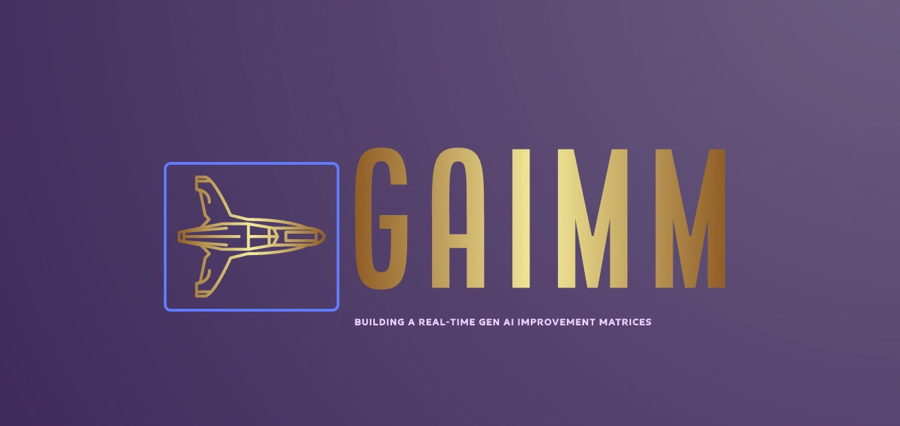

# Building a real-time Gen AI Improvement Matrices (GAIIM)



## About this package

This new solution will to evaluate and enhance Generative AI applications by using UpTrain, React & Python. It offers grading for over 20 preconfigured checks across language, code, and embedding scenarios. This is an encapsulation layer on top of UpTrain to show-case it's capability with a different perspective. Additionally, it conducts root cause analysis for failures and provides detailed insights and solutions for improvement. This project is for the advanced Python & React developer, Gen AI & data Science Newbie.


## How to use this package

(The following instructions apply to Posix/bash. Windows users should check
[here](https://docs.python.org/3/library/venv.html).)

First, clone this repository and open a terminal inside the root folder.


Install the requirements:

```bash
pip install -r requirements.txt
```

Install the above requirements.

Create and activate a new virtual environment (recommended) for consumer application by running
the following:

```bash
python3 -m venv senv
source senv/bin/activate
```

Run the server, which will interact with Open AI & UpTrain server by invoking the specific APIs.

```bash
python app.py
```

Please find the some of the important dependent package -

```

pip install Flask==3.0.3
pip install Flask-Cors==4.0.0
pip install numpy==1.26.4
pip install openai==1.17.0
pip install pandas==2.2.2
pip install uptrain==0.6.13


```

Create and activate a new virtual environment (recommended) for react-based consumer application by running
the following:

```bash
npx create-react-app evaluation-app
cd evaluation-app
npm start
```

Let's run the main Evaluation application, which will provide the Open AI & UpTrain response from the source API by providing text inputs & get the graphical chart apart from the following KPIs -

- Context Relevance Explanation
- Factual Accuracy Explanation
- Guideline Adherence Explanation
- Response Completeness Explanation
- Response Fluency Explanation
- Response Relevance Explanation
- Response Tonality Explanation

```bash
npm start

satyaki_de@Satyakis-MBP evaluation-app % npm start

> evaluation-app@0.1.0 start
> react-scripts start

You can now view evaluation-app in the browser.

  Local:            http://localhost:3001
  On Your Network:  http://112.118.1.13:3001

Note that the development build is not optimized.
To create a production build, use npm run build.

webpack compiled successfully
```

## Screenshots


## Resources

- To view the complete demo with sound, check out our [YouTube Page](https://youtu.be/7VQSncDoeeU).
- To view on Python, check out the [Python Page](https://docs.python.org/3/).
- To view more on the UpTrain, check out this [UpTrain Official Page](https://docs.uptrain.ai/getting-started/introduction).
- To view more on the React, check out this [React Official Page](https://legacy.reactjs.org/docs/getting-started.html).
